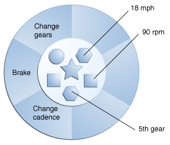

#Java

O Java é uma linguagem orientada a objetos, cross-platform e compilada

Ecosistema

Java Card

Java ME

Java SE\*

O Java SE, ou Standart Edition

Java MP

Java EE

<h1>Java Code Structure</h1>

Class

A class is a blueprint or prototype from which objects are created. This section defines a class that models the state and behavior of a real-world object. It intentionally focuses on the basics, showing how even a simple class can cleanly model state and behavior.

- Basic units of code;
- Describe data and logic of your program;

Package

A package is a namespace for organizing classes and interfaces in a logical manner. Placing your code into packages makes large software projects easier to manage. This section explains why this is useful, and introduces you to the Application Programming Interface (API) provided by the Java platform.

- Intermediate logical code aggregation;
- Group of classes;

Module

- High-level physical code aggregation;
- Group of packages;

<h1>Object-Oriented Programming Concepts</h1>

If you've never used an object-oriented programming language before, you'll need to learn a few basic concepts before you can begin writing any code. This lesson will introduce you to objects, classes, inheritance, interfaces, and packages. Each discussion focuses on how these concepts relate to the real world, while simultaneously providing an introduction to the syntax of the Java programming language.

<h2>Object</h2>

Objects are key to understanding object-oriented technology. They allow you to represent real-world concepts into a coding language. Real-world objects share two characteristics: State and behavior. Software objects are conceptually similar to real-world objects. An object stores its state in fields (variables in some programming languages) and exposes its behavior through methods (functions in some programming languages).

Consider a bicycle, for example:

<h2>Class</h2>

In the real world, you'll often find many individual objects all of the same kind. There may be thousands of other bicycles in existence, all of the same make and model. Each bicycle was built from the same set of blueprints and therefore contains the same components. In object-oriented terms, we say that your bicycle is an instance of the class of objects known as bicycles. A class is the blueprint from which individual objects are created.

The following Bicycle class is one possible implementation of a bicycle, written in Java:

    class Bicycle {

        int cadence = 0;
        int speed = 0;
        int gear = 1;

        void changeCadence(int newValue) {
             cadence = newValue;
        }

        void changeGear(int newValue) {
             gear = newValue;
        }

        void speedUp(int increment) {
             speed = speed + increment;
        }

        void applyBrakes(int decrement) {
             speed = speed - decrement;
        }

        void printStates() {
             System.out.println("cadence:" +
                 cadence + " speed:" +
                 speed + " gear:" + gear);
        }
    }

<h2></h2>

<h2></h2>

Language Basics

Variables
